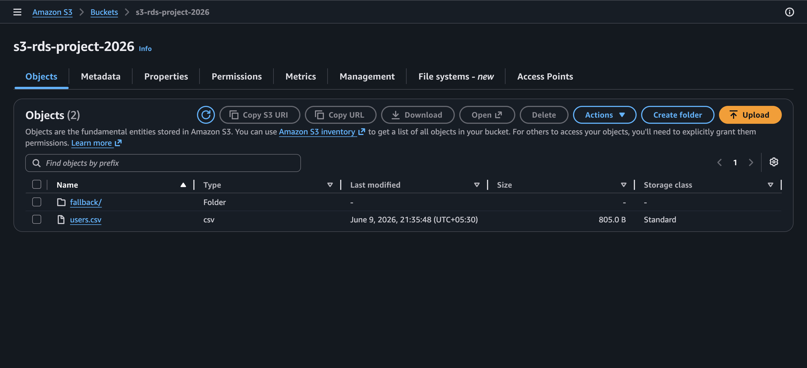
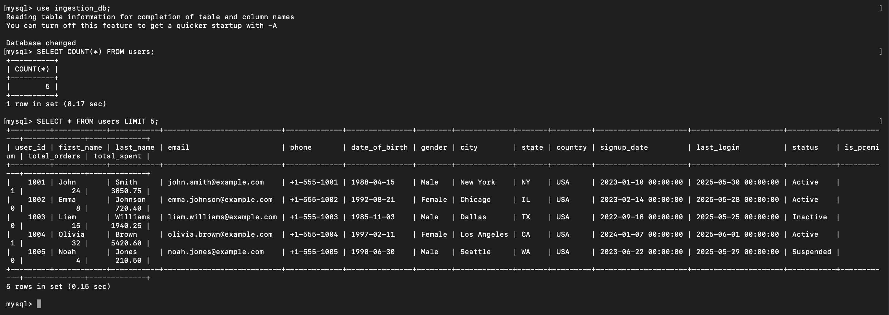
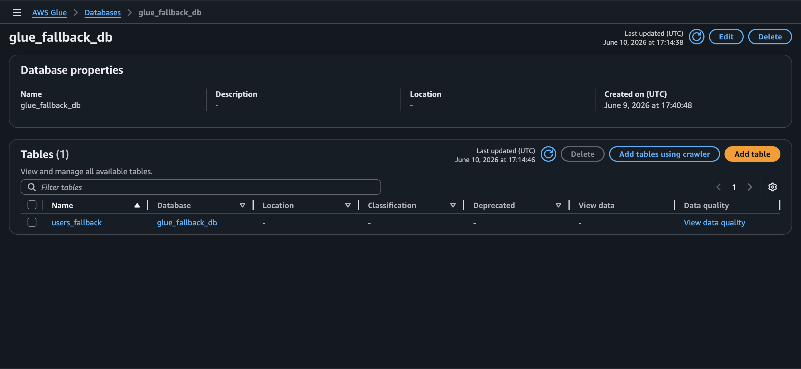

# AWS Fault-Tolerant Data Ingestion Pipeline

## Overview

This project implements a fault-tolerant cloud-native data ingestion pipeline using AWS services and Python.

The pipeline ingests CSV data from Amazon S3, validates it using Pandas, loads it into Amazon RDS MySQL, and automatically stores failed datasets in a fallback S3 zone registered in AWS Glue Catalog. A replay service reprocesses failed files once the database becomes available.

---

## Architecture

                 users.csv
                      |
                      v
                 Amazon S3
                      |
                      v
             Python Validation
                      |
             +--------+--------+
             |                 |
             v                 v
       Amazon RDS       S3 Fallback Zone
        (Primary)             |
                              v
                       AWS Glue Catalog
                              |
                              v
                       Replay Service
                              |
                              v
                         Amazon RDS

---

## Features

- CSV ingestion from Amazon S3
- Data validation using Pandas
- Loading data into Amazon RDS MySQL
- Automatic fallback to S3 on failures
- AWS Glue Catalog registration
- Replay service for failed datasets
- Dockerized deployment
- Idempotent replay using UPSERT logic

---

## Tech Stack

- Python
- AWS S3
- AWS RDS MySQL
- AWS Glue
- Docker
- Pandas
- SQLAlchemy
- Boto3

---

## Project Flow

1. Upload CSV to Amazon S3
2. Read file using Boto3
3. Validate data using Pandas
4. Load data into Amazon RDS
5. If load fails:
   - Save file to S3 fallback zone
   - Register metadata in AWS Glue
6. Replay service reprocesses failed files

---

## Screenshots

### Amazon S3

### Amazon RDS

### AWS Glue

### Docker Build

